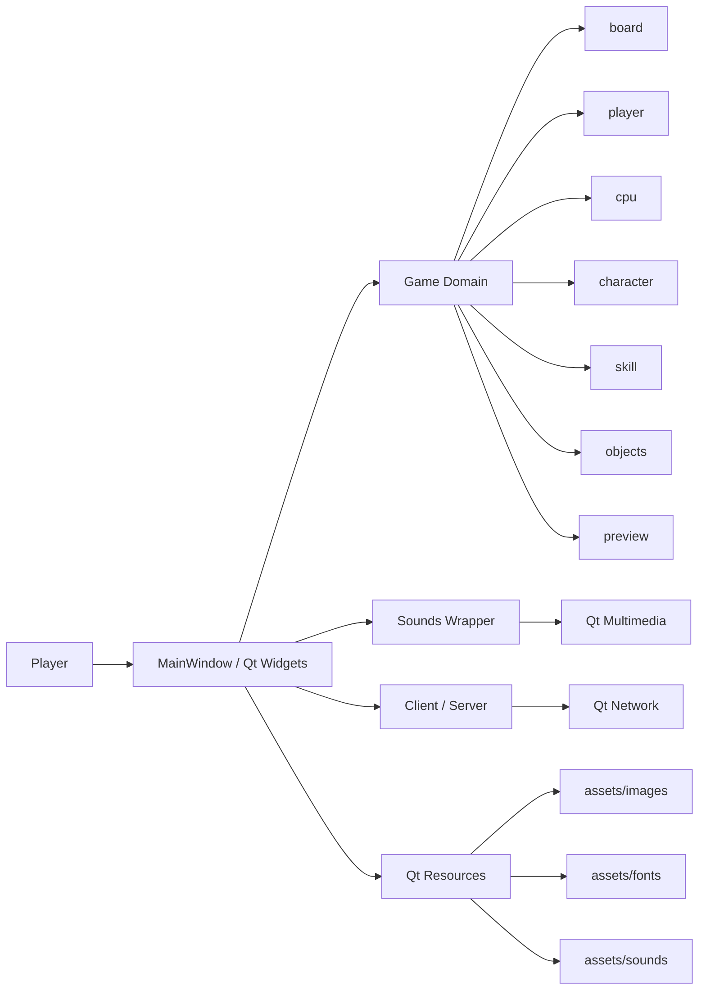
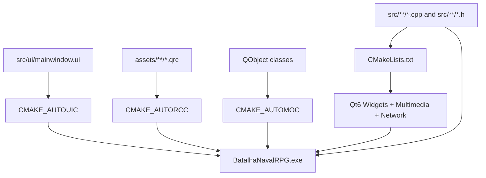
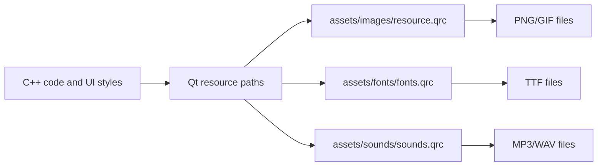
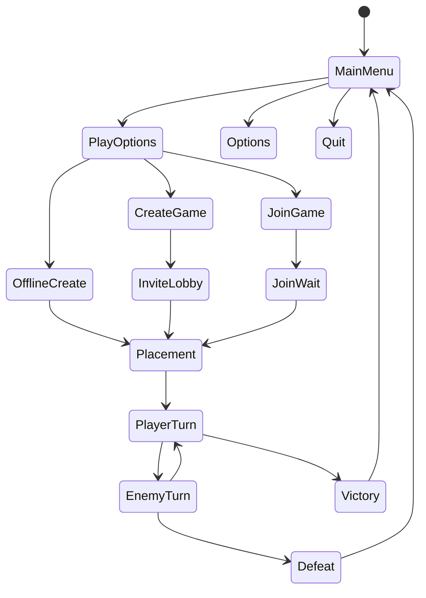
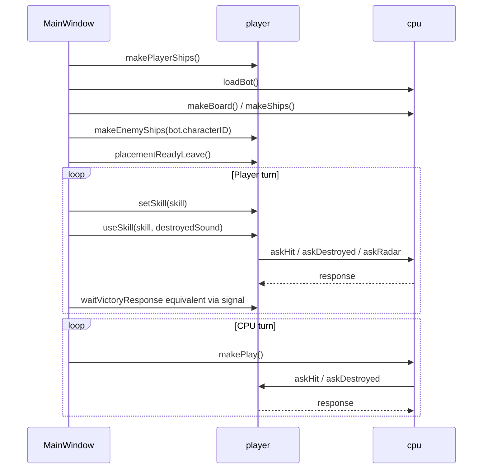
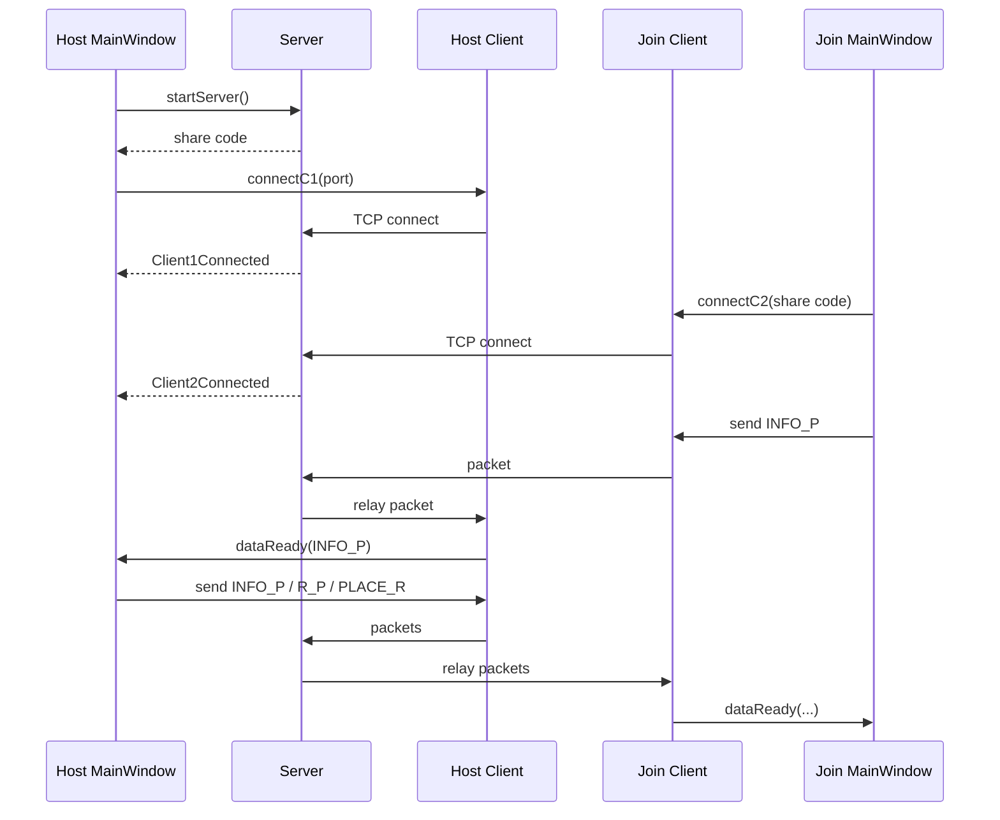
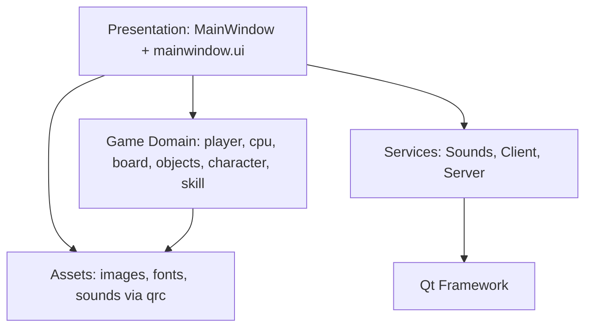

# Batalha Naval RPG: Full Project Context

This document gives a complete project overview for developers, maintainers, and AI assistants working on `Batalha Naval RPG`.

## Summary

`Batalha Naval RPG` is a desktop Qt/C++ game that combines classic Battleship placement and hit detection with RPG-style characters, skills, action points, cooldowns, sound, themed assets, and two game modes:

- Offline mode against a CPU opponent.
- Online host/join mode using a lightweight TCP relay server.

The game is built as a Qt Widgets application with a Qt Designer UI file, embedded Qt resources, CMake, and PowerShell helper scripts for Windows.

## Technical Stack

| Area | Technology |
| --- | --- |
| Language | C++17 |
| UI framework | Qt 6 Widgets |
| UI layout | Qt Designer `.ui` file |
| Audio | Qt 6 Multimedia |
| Networking | Qt 6 Network, `QTcpServer`, `QTcpSocket` |
| Build system | CMake 3.21+ |
| Preferred generator | Ninja |
| Primary OS target | Windows |
| Preferred Qt kit | Qt 6 MinGW 64-bit, originally Qt 6.6.1 |
| Resources | Qt Resource System `.qrc` |
| Scripts | PowerShell |

## Repository Layout

```text
Batalha-Naval-RPG/
  CMakeLists.txt
  CMakePresets.json
  README.md
  assets/
    fonts/
      fonts.qrc
      KGRedHands.ttf
      VanillaExtract.ttf
    images/
      resource.qrc
      gameicon.png
      ...
    sounds/
      sounds.qrc
      ...
  dist/
    windows/
      bnrpg_online.zip
  docs/
    BatalhaNavalRPG_GAME.pdf
    thumbnail-ai-brief.md
    project-context.md
  scripts/
    build.ps1
    run.ps1
    run-packaged.ps1
  src/
    app/
      main.cpp
      mainwindow.cpp
      mainwindow.h
    audio/
      sounds.cpp
      sounds.h
    game/
      board.cpp
      board.h
      character.cpp
      character.h
      cpu.cpp
      cpu.h
      objects.cpp
      objects.h
      passive.cpp
      passive.h
      player.cpp
      player.h
      position.h
      preview.cpp
      preview.h
      skill.cpp
      skill.h
    network/
      client.cpp
      client.h
      protocol.h
      server.cpp
      server.h
    ui/
      mainwindow.ui
```

## High-Level Architecture



The `MainWindow` class coordinates almost all UI state transitions and delegates gameplay work to `player`, `cpu`, audio, and networking objects.

## Build Architecture



The CMake target is `BatalhaNavalRPG`. It links:

- `Qt6::Widgets`
- `Qt6::Multimedia`
- `Qt6::Network`

The application uses `WIN32_EXECUTABLE TRUE` so it launches as a desktop app on Windows.

## Runtime Resources

The code intentionally keeps the old runtime resource paths stable:

| Runtime path | Backing manifest |
| --- | --- |
| `:/resources/...` | `assets/images/resource.qrc` |
| `:/fonts/...` | `assets/fonts/fonts.qrc` |
| `qrc:/sounds/...` | `assets/sounds/sounds.qrc` |

This means UI styles and existing C++ image/audio references do not need to know the physical `assets/` folder layout.



## Core Game Model

### Board

`board` owns:

- A `QGraphicsScene`.
- Brushes for hit/miss/radar display.
- A black grid pen.
- A cross texture loaded from `:/resources/cross.png`.

Important constants:

| Constant | Value | Meaning |
| --- | ---: | --- |
| `SQUARE` | `40` | Pixel size of one board square |
| `NUM_SQUARES` | `12` | Board width and height in squares |
| `NUM_SHIP` | `6` | Number of ships |

### Ships

`objects` represents draggable ships on the placement board. It inherits from:

- `QObject`
- `QGraphicsRectItem`

Responsibilities:

- Mouse dragging.
- Right-click rotation while dragging.
- Snap-to-grid placement.
- Emit placement validation signals.
- Store occupied `squares`.
- Track `sunk`, `rotated`, and placement flags.

### Position Types

`position.h` defines:

```cpp
struct pos
{
    int x = 0;
    int y = 0;
};

struct squares
{
    pos pos;
    bool hit = false;
};
```

`pos` is used for board coordinates and pixel coordinates depending on context. Existing game logic distinguishes these by call site.

### Skills

`skill` owns:

- `QString name`
- `QString description`
- `int cost`
- `pos aoeSize`
- `int cooldown`
- `bool used`
- `bool placed`
- `bool destroy`

Skill dimensions use `pos`, where:

- `x` is width in board squares.
- `y` is height in board squares.

### Preview

`preview` is a movable `QGraphicsRectItem` used to show the selected skill AOE on the enemy board. It snaps to the board grid and clamps inside the 12x12 board.

### Characters

`character` contains:

- `name`
- `preview`
- `normal`
- `primary`
- `secondary`
- `ultimate`
- `passive`

Character IDs:

| ID | Character |
| ---: | --- |
| `1` | Captain |
| `2` | Pirate |
| `3` | Space Commander |
| `-1` | Reset/none |

Each character defines four skills and one passive.

## Character/Skill Overview

| Character | Normal | Primary | Secondary | Ultimate | Passive |
| --- | --- | --- | --- | --- | --- |
| Captain | Radar | Air Strike | Torpedo | Nuclear | Radar-focused normal skill |
| Pirate | Cannon Ball | Cannon Barrage | Explosive Barel | Humungous! | Looting action-point bonus |
| Space Commander | Phaser Weapon | Ion Blaster | Double Beam | Superlaser | Phaser can shoot again on hit |

## Main UI Flow



## Offline Gameplay Flow



Offline mode connects `player` and `cpu` with Qt signals. No TCP sockets are used.

## Online Multiplayer Flow



Online mode uses:

- `Server`: accepts two sockets and relays bytes between them.
- `Client`: owns a `QTcpSocket`, sends packets, emits `dataReady`.
- `protocol.h`: shared packet codes.

The server does not understand game rules. It only accepts, tracks, and relays packets.

## Packet Protocol

Packet codes are single-character/single-byte prefixes.

| Code | Name | Meaning |
| --- | --- | --- |
| `0` | `INFO_P` | Player info: character ID + player name |
| `1` | `R_P` | Ready/start placement transition |
| `2` | `PLACE_R` | Placement ready |
| `3` | `AHIT_P` | Ask hit at a position |
| `4` | `RHIT_P` | Respond to hit request |
| `5` | `ADESTROY_P` | Ask whether a ship was destroyed |
| `6` | `RDESTROY_P` | Respond with destroy result and ship info |
| `7` | `AVIC_P` | Ask whether opponent lost |
| `8` | `RVIC_P` | Respond to victory/loss check |
| `9` | `TURN_P` | Pass turn to opponent |
| `A` | `ARADAR_P` | Ask radar result |
| `B` | `RRADAR_P` | Respond to radar request |

Example position payload format:

```text
<packetCode><x>.<y>.
```

Example:

```text
310.4.
```

This means `AHIT_P` at board position `x=10`, `y=4`.

## Audio System

`Sounds` wraps Qt Multimedia:

- `QMediaPlayer`
- `QAudioOutput`

It supports:

- `setSound(QUrl, volumePercent, loop)`
- `playSound()`
- `stop()`
- `setVolume(float)`

Sounds are loaded from `qrc:/sounds/...`.

The main sound groups are:

- Menu music.
- Character themes.
- Victory/defeat music.
- Character voice lines.
- Button click sound.
- Hit and explosion effects.

## MainWindow Responsibilities

`MainWindow` is the central coordinator. It handles:

- Window setup and stacked widget page changes.
- Menu navigation.
- Character selection.
- Name and join-code validation.
- Board background changes.
- Ship placement page.
- Offline CPU setup.
- Online lobby setup.
- Player turn and enemy turn transitions.
- Skill selection and skill info overlays.
- Victory/defeat screens.
- Audio loading and volume sliders.
- Network packet dispatch.

## Build And Run

Set the Qt path:

```powershell
$env:QT_DIR = "C:\Qt\6.6.1\mingw_64"
```

Build:

```powershell
.\scripts\build.ps1 -QtDir $env:QT_DIR
```

Run:

```powershell
.\scripts\run.ps1 -QtDir $env:QT_DIR
```

Run packaged version:

```powershell
.\scripts\run-packaged.ps1
```

Direct CMake:

```powershell
cmake --preset windows-debug
cmake --build --preset windows-debug
```

## Development Notes

### Adding Images

1. Put the file under `assets/images`.
2. Add it to `assets/images/resource.qrc`.
3. Reference it as `:/resources/file.png`.

### Adding Sounds

1. Put the file under `assets/sounds`.
2. Add it to `assets/sounds/sounds.qrc`.
3. Reference it as `qrc:/sounds/file.mp3`.

### Adding Fonts

1. Put the file under `assets/fonts`.
2. Add it to `assets/fonts/fonts.qrc`.
3. Load it in `main.cpp` with `QFontDatabase::addApplicationFont(":/fonts/file.ttf")`.

### Adding A Skill

1. Add the skill data in `character::loadCharacter`.
2. Set cost with `setCost`.
3. Set AOE with `setAoeSize({width, height})`.
4. Update UI labels or buttons if a new skill slot is introduced.
5. Add custom behavior in `player::useSkill` and `cpu::useSkill` if the skill is not a normal AOE hit.

### Adding A Network Packet

1. Add a constant to `src/network/protocol.h`.
2. Send it from `Client::sendData` callers.
3. Handle it in `MainWindow::clientDataReceived`.
4. Add response/wait behavior in `player::waitPacket` if it is gameplay-related.
5. Keep packet payloads short and deterministic because the relay server forwards raw bytes.

## Smoke Test Checklist

Offline:

- App launches.
- Menu background renders.
- Sounds play without crashing.
- Character selection highlights.
- Placement board shows a 12x12 grid.
- Ships can be dragged and rotated.
- Randomize places all ships.
- Starting match shows correct skill labels.
- Skill preview moves and snaps to grid.
- Player hits/misses draw on enemy board.
- CPU turn resolves and returns to player.
- Victory/defeat screens render.

Online:

- Host creates a share code.
- Second instance joins with the code.
- Host sees client 2 info.
- Both players can ready.
- Placement ready transitions correctly.
- Turn pass packet enables opponent turn.
- Hit/destroy/radar packets return responses.
- Victory/defeat checks relay correctly.

Resources:

- `gameicon.png` appears in UI.
- Character icons appear.
- Ship images load.
- Backgrounds load.
- Sound files load.
- Fonts load.

## Known Constraints

- The project is currently designed around Qt Widgets, not QML.
- The main UI is managed by one large `MainWindow` class.
- The online server is a simple relay, not a secure or authoritative server.
- The packet protocol is compact and custom; it is not JSON or Protobuf.
- The primary supported setup is Windows + Qt 6 MinGW.
- CMake configure requires `QT_DIR` or `CMAKE_PREFIX_PATH` to point at a Qt 6 installation.

## Mental Model For Future Work

Think of the project in four layers:



Most feature work starts in `MainWindow`, but durable gameplay changes should be pushed into `src/game` where possible.

## Important Files

| File | Purpose |
| --- | --- |
| `CMakeLists.txt` | Main build target |
| `CMakePresets.json` | Windows debug/release presets |
| `src/app/main.cpp` | Qt application entry point |
| `src/app/mainwindow.cpp` | Main UI/game coordinator |
| `src/ui/mainwindow.ui` | Qt Designer UI |
| `src/game/player.cpp` | Human player game logic |
| `src/game/cpu.cpp` | CPU opponent logic |
| `src/game/character.cpp` | Character and skill definitions |
| `src/network/protocol.h` | Packet constants |
| `src/network/server.cpp` | TCP relay server |
| `src/network/client.cpp` | TCP client wrapper |
| `src/audio/sounds.cpp` | Audio playback wrapper |
| `assets/images/resource.qrc` | Embedded images |
| `assets/sounds/sounds.qrc` | Embedded audio |
| `assets/fonts/fonts.qrc` | Embedded fonts |
| `scripts/build.ps1` | Build helper |
| `scripts/run.ps1` | Build and run helper |
| `scripts/run-packaged.ps1` | Packaged executable helper |
